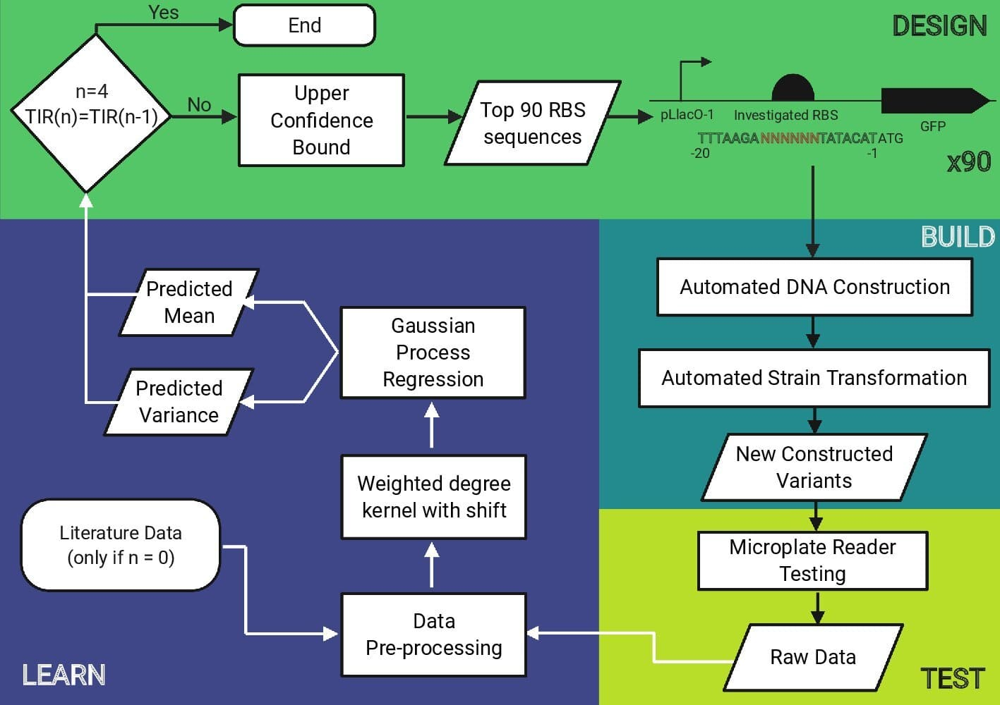

# Machine Learning guided workflow for Ribosome Binding Site engineering

Fine control of gene expression can be achieved through engineering transcriptional and translation control elements, including the Ribosome Binding Site (RBS).
Unfortunately, RBSs are not understood at the level of finesse required for reliable design. 
To address this problem, we have created a machine learning (ML) enabled workflow for the design of bacterial RBSs.
We used Gaussian Process Regression for prediction and the Upper Confidence Bound-based Bandit algorithm for recommendation of genetic designs to be tested in vitro.
We have integrated the ML algorithms with laboratory automation and high-throughput processes, creating a robust workflow for the design of custom RBSs.
Using our workflow, we generated a novel library of diverse RBSs with a wide range of expression levels.
Notably, a high number of these sites demonstrate translation initiation rates equalling or exceeding the currently known strong RBSs.

    

The reproducible code of our work is provided in *synbio_rbs*. 
For illustration of our pipeline and design (Round 1-3), see *synbio_rbs/examples/RBS_bandit_design.ipynb*. 
For the reproducible plots included in the paper, see *synbio_rbs/examples/paper_plot.ipynb*.
The design of Round-0 is illustrated in *synbio_rbs/examples/Round0*.

## Environment setup:  
We recommend you to build a python virtual environment with [Anaconda](https://docs.anaconda.com/anaconda/install/linux/).
```
conda create -n synbio_ml python==3.6  
conda activate synbio_ml  
pip install -r requirements.txt  
```
